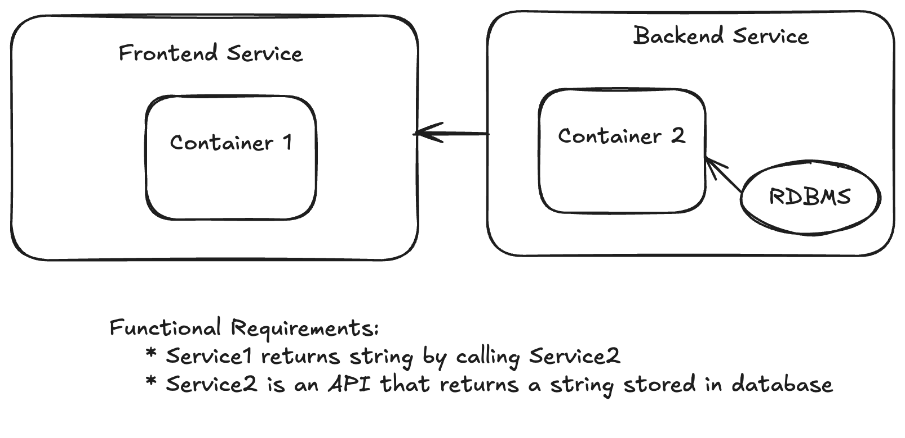

# myapp-ps
An exercise in building a frontend service that returns a string from an API endpoint. The frontend service calls a backend service API that returns the string. The backend service fetches the string from a database. 



## Installation

### Requirements

```
docker
openssl
curl
POSIX shell
```

### Setup

In a terminal, create and use a working directory.
```
mkdir myapp-ps && cd myapp-ps
```

Generate and insert a password for the database into a file named `postgres_password.txt`.
```
openssl rand -base64 12 > postgres_password.txt
```

Create a database connection string from the value of `postgres_password.txt` into a file named `database_url.txt`.
```
echo postgresql://postgres:`cat postgres_password.txt`@db:5432/mydb > database_url.txt
```

Download the deployment script.
```
curl -O https://raw.githubusercontent.com/ls339/myapp-ps/refs/heads/main/README.md
```

### Running

Do the thing.
```
docker compose up -d --build
```
