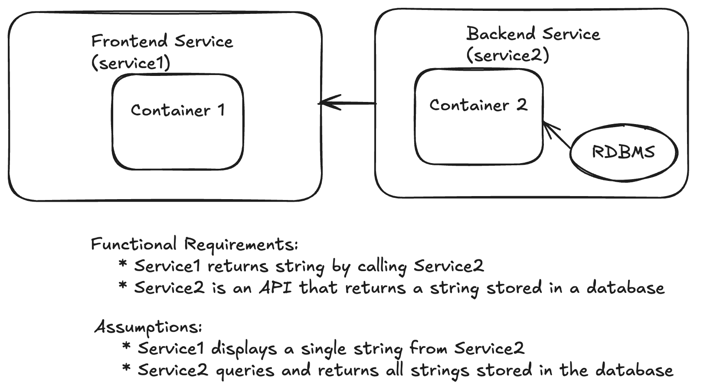

# myapp-ps
An exercise in building a frontend service that returns a string from an API endpoint. The frontend service calls a backend service API that returns the string. The backend service fetches the string from a database. 



## Installation

### Requirements

```
POSIX shell
docker
openssl
curl
```

### Setup

In a terminal, create and use a working directory.
```
mkdir myapp-ps && cd myapp-ps
```

Generate a password for the database in a file named `postgres_password.txt`.
```
openssl rand -base64 -out postgres_password.txt 8
```

Create a database connection string from the value of `postgres_password.txt` in a file named `database_url.txt`.
```
echo "postgresql://postgres:`cat postgres_password.txt`@db:5432/mydb" > database_url.txt
```

Download the deployment script.
```
curl -O https://raw.githubusercontent.com/ls339/myapp-ps/refs/heads/ls339/main/compose.yaml
```

### Deployment

Use docker compose to deploy the containers locally.
```
docker compose up -d --build
```

Access the frontend from http://localhost:8080/api/display

### Cleanup

```
docker compose down --rmi "all"
```

```
cd ..;rm -rf myapps-ps
```
